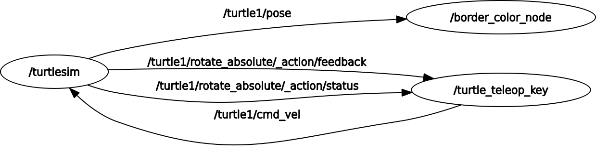

# Efr-ROS2-autonomous-systems

This is a task repository for the Elbflorace Formula Student team - autonomous systems division.
The following are the required steps in order to set up ROS2 along with turtlesim and rqt. 

If you do **not** want to set up for **development** skip to the [Run](#run) section.

*Latest ROS version currently (2023): [Iron](https://docs.ros.org/en/iron/index.html)*


## Contents
- [Setup](#setup)
- [Run](#run)
- [Introduction Task](#introduction)

## Setup
This setup is made primarily for Windows platforms, for Ubuntu WSL and GWSL are **not** required.
### Downloads
| Tool              | Platform |                                                         Link |
| :---------------- | :------: | -----------------------------------------------------------: |
| WSL2              | Windows  | [WSL](https://learn.microsoft.com/en-us/windows/wsl/install) |
| GWSL *(optional)* | Windows  |                      [GWSL](https://opticos.github.io/gwsl/) |

<p> Now that the pre-requisites are done for Windows, we can setup and configure the simulator.

### ROS2
[Link](https://docs.ros.org/en/iron/Installation/Ubuntu-Install-Debians.html) for the official installation guide on Ubuntu systems. 

**Enable** repositories
```
sudo apt install software-properties-common
sudo add-apt-repository universe
```
- Add the ROS 2 GPG key with apt.
```
sudo apt update && sudo apt install curl -y
sudo curl -sSL https://raw.githubusercontent.com/ros/rosdistro/master/ros.key -o /usr/share/keyrings/ros-archive-keyring.gpg
```
- Add the repository to your sources list.
```
echo "deb [arch=$(dpkg --print-architecture) signed-by=/usr/share/keyrings/ros-archive-keyring.gpg] http://packages.ros.org/ros2/ubuntu $(. /etc/os-release && echo $UBUNTU_CODENAME) main" | sudo tee /etc/apt/sources.list.d/ros2.list > /dev/null
```
- Install development tools *(required in order to build packages)*
```
sudo apt update && sudo apt install ros-dev-tools
```
**Install** ROS2
- Quick apt repository caches update before install
```
sudo apt install ros-iron-desktop
```
**Environment** setup
```
# Possible values are: setup.bash, setup.sh, setup.zsh depending on your install
source /opt/ros/iron/setup.bash
```
Source the ROS installation using the [link](https://docs.ros.org/en/iron/Tutorials/Beginner-CLI-Tools/Configuring-ROS2-Environment.html). So that the `source` command is not required each time we need access to ROS2. 
### turtlesim
[Link](https://docs.ros.org/en/iron/Tutorials/Beginner-CLI-Tools/Introducing-Turtlesim/Introducing-Turtlesim.html) to the official documentation
    ```
    sudo apt install ros-iron-turtlesim
    ```
- Test start
    ```
    ros2 run turtlesim turtlesim_node
    ```
### rqt
[Link](https://docs.ros.org/en/iron/Tutorials/Beginner-CLI-Tools/Introducing-Turtlesim/Introducing-Turtlesim.html) to the official documentation
    ```
    sudo apt install ~nros-iron-rqt*
    ```
- Test run
    ```
    rqt
    ```
## Run
### Installation
 Install required tools: *ROS2, colcon, Xterm*
 - [ROS2](https://docs.ros.org/en/iron/index.html) 
    Install steps [above](#ros2)
 - [colcon](https://colcon.readthedocs.io/en/released/) - command line tool used for building
    ```
    sudo apt install python3-colcon-common-extensions
    ```
 - Xterm - a terminal emulator for the X Window System
    ```
    sudo apt-get install xterm 
    ```
### App Running
- Go from root directory to your src dir from ros2 (ros2 workspace)
    ```
    cd ros2_ws/src
    ```
- Clone the Github project containing the package
    ```
    git clone https://github.com/Daniele1209/Efr-ROS2-autonomous-driving.git
    ```
- Go back to workspace directory 
    ```
    cd ~/ros2_ws
    ```
- **Build** the cloned package using *colcon*  
    ```
    colcon build
    ```
- Source the setup file
    ```
    source install/local_setup.bash
    ```
- **Run** the package
    ```
    ros2 launch turtlesim_border_color turtle_border_color.launch.py
    ```

<br>

Finally, if you installed [rqt](#rqt) from previous steps, running `rqt_graph` in a new terminal should output the following nodes: 

